# Claude Code Anywhere 随行终端 — UML 图集

> 基于 `specs/001-remote-terminal/spec.md` 绘制
> 参考源文档：PRODUCT_SPEC.md, DETAILED_REQUIREMENTS.md, CLARIFICATIONS.md
> 创建日期：2026-02-13
>
> 图表类型：用例图 ×1, 时序图 ×6, 模块图 ×1, 状态图 ×4（共 12 张）

---

## 目录

1. [用例图 — 角色与功能映射](#1-用例图--角色与功能映射)
2. [时序图 — 配对认证](#2-时序图--配对认证)
3. [时序图 — 输入仲裁](#3-时序图--输入仲裁)
4. [时序图 — 断线重连与输出重放](#4-时序图--断线重连与输出重放)
5. [时序图 — 设备优先级通知路由](#5-时序图--设备优先级通知路由)
6. [时序图 — Agent Team 生命周期](#6-时序图--agent-team-生命周期)
7. [时序图 — 授权审批闭环](#7-时序图--授权审批闭环)
8. [模块图 — 系统架构](#8-模块图--系统架构)
9. [状态图 — 客户端连接状态机](#9-状态图--客户端连接状态机)
10. [状态图 — 实例状态机](#10-状态图--实例状态机)
11. [状态图 — 输入消息状态机](#11-状态图--输入消息状态机)
12. [状态图 — 通知事件状态机](#12-状态图--通知事件状态机)

---

## 1. 用例图 — 角色与功能映射

> 4 种用户角色与系统用例的对应关系。按功能域分组。

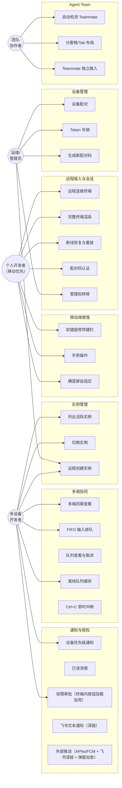

---

## 2. 时序图 — 配对认证

> 三种认证流程：首次配对（首个配对者成为管理员）、已配对设备重连、管理权转移。
> 参考：CLARIFICATIONS #6（认证 Token 机制）+ Constitution v1.1.0 原则 IV。

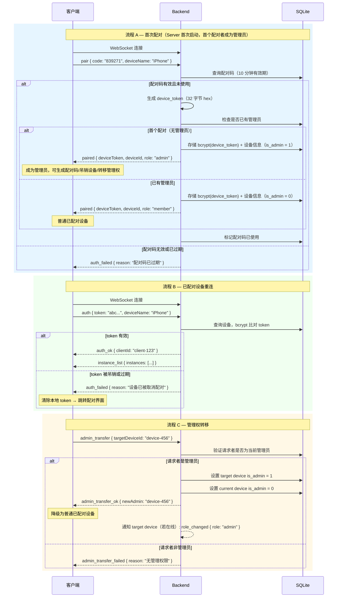

---

## 3. 时序图 — 输入仲裁

> 多端输入 FIFO 队列、ACK 确认、去重、取消、Ctrl+C 即时中断。
> 参考：CLARIFICATIONS #4（砍掉主控权，所有输入进 FIFO 队列）。

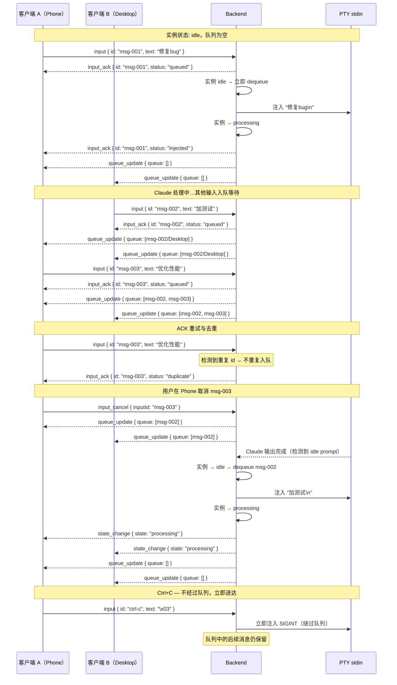

---

## 4. 时序图 — 断线重连与输出重放

> 断网 → 服务端缓冲 → 重连 → offset 重放 → 离线队列确认发送。
> 参考：CLARIFICATIONS #5（离线队列重连确认策略）、#8（缓冲区溢出处理）。

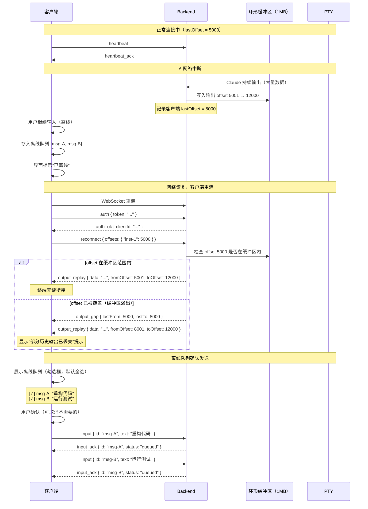

---

## 5. 时序图 — 设备优先级通知路由

> 设备优先级模型：优先通知电脑端 → 已读消偿 → 外部推送升级链。
> 参考：CLARIFICATIONS #12（通知机制重设计）、#1（通知层级口径统一）。

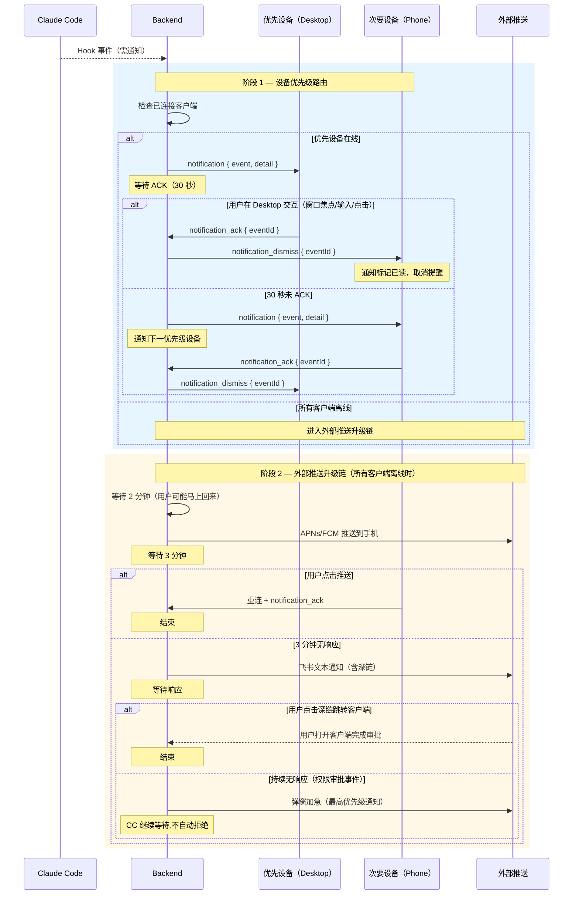

---

## 6. 时序图 — Agent Team 生命周期

> 通过 Hook 事件（SubagentStart/SubagentStop）检测 Teammate 创建与退出。
> 参考：CLARIFICATIONS #10（Agent Team 检测机制）。

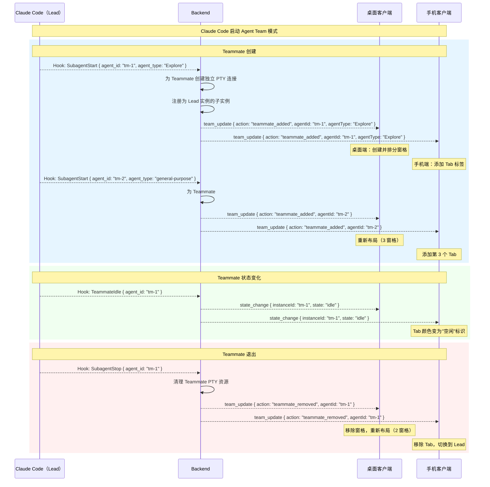

---

## 7. 时序图 — 授权审批闭环

> 权限审批事件的升级路径：设备优先级 → 推送 → 飞书文本通知（深链） → 弹窗加急。CC 侧保持持续等待,不设超时自动拒绝。
> 参考：CLARIFICATIONS #12.4（各事件类型的升级规则）。

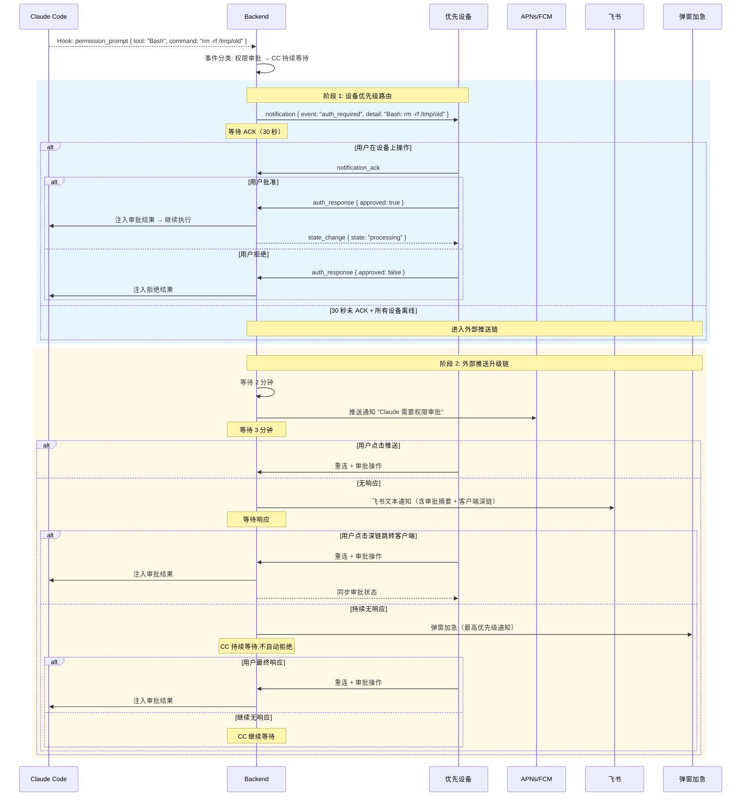

---

## 8. 模块图 — 系统架构

> Backend 8 模块 + Frontend 8 模块 + 外部依赖。各模块间的数据流与依赖关系。

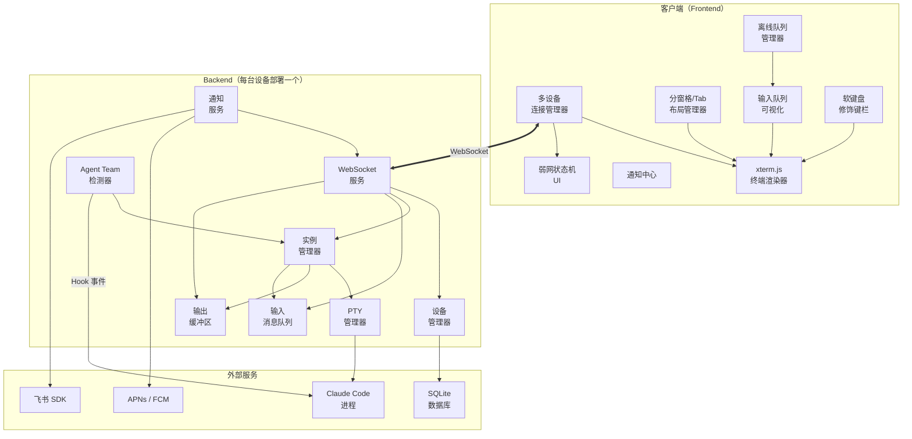

### 模块职责说明

| 层 | 模块 | 核心职责 |
|---|---|---|
| Backend | WebSocket 服务 | 连接管理、认证握手、心跳检测、多客户端广播 |
| Backend | PTY 管理器 | node-pty 创建/销毁、stdin/stdout 流转发 |
| Backend | 实例管理器 | 多实例生命周期（创建/销毁/列出/切换） |
| Backend | 输出缓冲区 | 环形缓冲 1MB/实例、全局写入 offset 追踪 |
| Backend | 输入消息队列 | FIFO 队列、ACK 确认、消息去重、队列广播 |
| Backend | Agent Team 检测器 | Hook 事件监听（SubagentStart/Stop/TeammateIdle） |
| Backend | 通知服务 | 设备优先级路由、已读消偿、外部推送升级链 |
| Backend | 设备管理器 | 配对码管理、device_token 生命周期、SQLite 存储 |
| Frontend | xterm.js 终端渲染器 | ANSI/TUI 渲染、SearchAddon 搜索、固定 120 列 |
| Frontend | 多设备连接管理器 | 多 WebSocket 并行连接、设备面板 |
| Frontend | 分窗格/Tab 布局管理器 | Agent Team 桌面分窗格、手机 Tab 切换 |
| Frontend | 输入队列可视化 | 队列状态展示、来源设备标识、取消操作 |
| Frontend | 通知中心 | 通知展示、ACK 触发、已读消偿同步 |
| Frontend | 软键盘修饰键栏 | 修饰键 toggle/lock、组合键发送（移动端） |
| Frontend | 离线队列管理器 | 断网输入缓存、重连勾选确认发送 |
| Frontend | 弱网状态机 UI | 连接状态指示器、降频模式切换 |

---

## 9. 状态图 — 客户端连接状态机

> 三态状态机 + 过渡态 RECONNECTING。
> 参考：PRODUCT_SPEC 弱网处理、CLARIFICATIONS #12.5（各平台后台能力）。

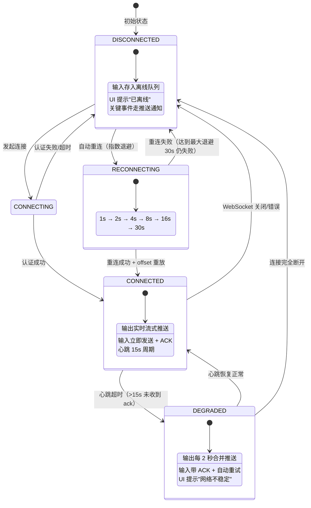

---

## 10. 状态图 — 实例状态机

> Claude Code 实例的运行状态。每个实例独立维护。

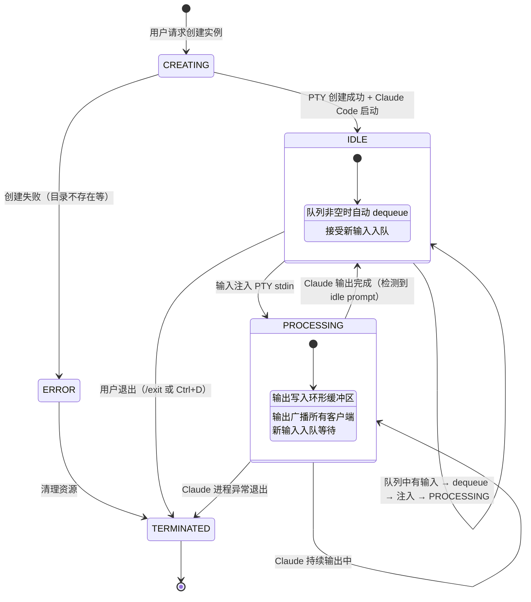

---

## 11. 状态图 — 输入消息状态机

> 每条用户输入从创建到完成的生命周期。

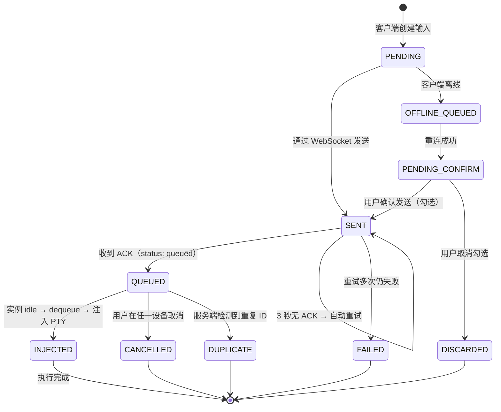

---

## 12. 状态图 — 通知事件状态机

> 通知事件从创建到最终处置的完整状态流转。
> 参考：CLARIFICATIONS #12.4（各事件类型的升级规则）。

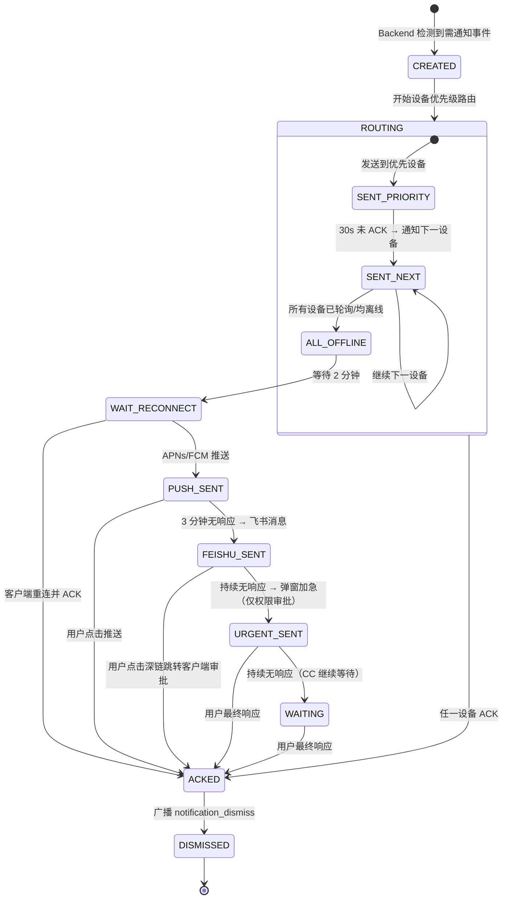

### 各事件类型的升级范围

| 事件类型 | 设备路由 | 推送 | 飞书（文本+深链） | 弹窗加急 | 超时策略 |
|---|:---:|:---:|:---:|:---:|---|
| 权限审批 | ✅ | ✅ | ✅ | ✅ | 持续等待（CC 原生行为） |
| Plan 等待审核 | ✅ | ✅ | ✅ | ✅ | 持续等待 |
| 执行出错 | ✅ | ✅ | ✅ | - | 仅通知 |
| 任务完成 | ✅ | ✅ | - | - | 仅通知 |
| 等待输入 | ✅ | ✅ | - | - | 仅通知 |
| 对话框选择 | ✅ | ✅ | ✅ | ✅ | 持续等待 |

---

## 版本记录

| 版本 | 日期 | 说明 |
|---|---|---|
| v1.2 | 2026-02-24 | 恢复弹窗加急升级步骤：时序图 5/7、状态图 12、事件类型表新增弹窗加急列；UC18 补充弹窗加急；修正 CC 持续等待（去掉超时默认拒绝） |
| v1.1 | 2026-02-13 | 认证流程重构：去掉 localhost 免配对，改为首次配对即管理员 + 管理权转移流程；用例图 UC05 更新 |
| v1.0 | 2026-02-13 | 初始版本，12 张 Mermaid 图（1 用例 + 6 时序 + 1 模块 + 4 状态） |
